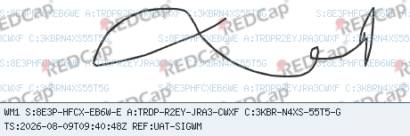

# Watermarked Signatures

Watermarked Signatures is a REDCap External Module that adds a visible,
context-bound watermark to newly captured REDCap signatures. It supports both
**Signature** and **Enhanced Signature** fields.

The module watermark is created on the server before REDCap stores the final
PNG. It records capture provenance and, after the form is saved, binds that
signature to the saved REDCap context. The module can later verify the stored
file, its watermark scope, and whether that signature is still the value in its
field.

This module is an audit and verification aid. It does not identify the person
who drew the signature, replace REDCap user authentication, or by itself meet
any legal or institutional requirement for electronic signatures or consent.

## Example



## Role-specific help

Role-specific help is provided on the respective project and Control Center
verification pages.

## Before you begin

This release requires REDCap 17.3.0 or later. A REDCap administrator must first
install the External Module using the institution's normal module-management
process and make it available to the project.

The module does not alter signatures that were already stored before a field is
configured. It also does not backfill watermarking for existing files.

## Set up a project

1. Enable **Watermarked Signatures** for the project from REDCap's External
   Modules page.
2. In the Online Designer or Data Dictionary, choose each existing **Signature**
   or **Enhanced Signature** field that should be watermarked.
3. Add the following field annotation/action tag:

   ```text
   @WATERMARKED-SIGNATURE
   ```

4. Save the field changes. Open the instrument again before testing a new
   signature.
5. Capture and save a test signature. The saved image should have a watermark
   overlay and a footer beginning with `WM1`.

The action tag has no parameters. It can appear alongside other field
annotations. It has no effect on ordinary file-upload fields or on fields that
are not configured by REDCap as Signature or Enhanced Signature fields.

### Project settings

The module has three project settings.

| Setting | Default | Guidance |
|---|---:|---|
| **Retain unbound signature-upload provenance for this many days** | 90 days | Controls cleanup of captures that were uploaded but never bound by a successful form save. Use `0` to retain them indefinitely. Values above 3650 are capped at 3650 days. Successful bindings, rename history, and error events are retained. |
| **Public project reference** | Blank | An optional 1–30 character public identifier printed as `REF:` on every newly captured image. It may use ASCII letters, digits, spaces, periods, hyphens, underscores, or slashes. Do not use a project title, protocol number, or any other value that should not be visible in exports and screenshots. |
| **Output debug information to the browser console** | Off | Use only while troubleshooting client-side behavior, then turn it off. |

Changing the public project reference affects only future captures. It does not
modify existing images or their recorded provenance.

## Capture a signature

For a configured field, users follow the normal REDCap signature workflow:

1. Open the form or survey.
2. Draw or replace the signature using the normal REDCap signature dialog.
3. Complete the form submission so REDCap saves the field.

No separate upload or confirmation step is added. On a successful capture, the
module replaces the submitted PNG with the watermarked PNG before REDCap stores
it. The footer contains values similar to:

```text
WM1 S:5622-9F1F-AHCA-K A:ABCD-1234-EFGH-5678 C:7JKM-9NPQ-RSTV-2
TS:2026-08-09T12:34:56.789Z REF:STUDY-42
```

- `S:` is the **capture reference**. It uniquely identifies this capture and is
  the value used for normal verification.
- `A:` is the stable watermark anchor for the field context.
- `C:` is a field-specific context reference.
- `TS:` is the server-generated UTC capture timestamp. It is not a statement
  of signer identity or a qualified signing time.
- `REF:` appears only if the optional public project reference is configured.

Keep the complete `S:` value with any exported image or verification request.
The project verification page asks for the part after `S:` because the prefix
is already shown next to its input.

### Expected lifecycle

An upload becomes a fully bound signature only after REDCap successfully saves
the form or survey response. If a user uploads a signature and abandons the
form, the module retains upload provenance but has no authoritative record to
bind; verification will show **Upload not bound**. Those unbound entries follow
the retention setting above.

If a user deletes and redraws before saving, every upload receives a new
capture reference. Only the edoc that REDCap actually saves in the field is
bound. When a saved signature is later replaced or cleared, its original
binding remains valid history and verification can show it as a valid
historical signature.

## Verify a signature

Verification checks the **stored REDCap edoc**, not a separately uploaded copy
or screenshot of an image. It performs exact lookup only; there is no browse,
partial-reference, or wildcard search.

### Project verification page

Choose **Verify watermarked signature** from the project module links and enter
the complete value printed after `S:`. The page is available to:

- REDCap superusers; and
- project users with at least read-only access to at least one instrument that
  contains a configured signature field.

The result is restricted to the current project, to forms the user may view,
and, for users in a Data Access Group (DAG), to records in that DAG. An
unbound capture has no record/DAG association, so it is not shown to
DAG-restricted users.

The result includes these checks when they can be performed:

| Check | What it confirms |
|---|---|
| **Binding MAC** | The saved binding record has not been altered. |
| **Upload/binding relationship** | The binding matches the captured signature provenance. |
| **Stable-scope anchor** | The watermark scope is consistent with the project, event, instrument, and field. |
| **Edoc exists** | The saved REDCap file is still available. |
| **Final edoc SHA-256** | The stored file bytes match the watermarked file recorded at capture. |
| **Field currently points to edoc** | The signature is still the current value of its bound field. |

### Administrator verification page

REDCap superusers can use **Administrator signature verification** in the
Control Center. It performs the same verification across all projects using the
module and accepts either:

- the complete capture-reference suffix printed after `S:`; or
- a positive numeric edoc ID.

Enter one lookup value at a time. The administrator page also shows authorized
technical log history, including relevant binding, rename, and error events.
It does not expose signature bytes, signed-envelope values, or binding MAC
values.

### Understand the result

| Result | Meaning | Usual next step |
|---|---|---|
| **Valid and current** | All available integrity checks passed and the field still contains this signature. | No action needed. |
| **Valid historical signature** | Integrity checks passed, but the field now contains a different value or is empty. | Confirm whether the signature was intentionally replaced or cleared. |
| **Upload not bound** | The capture exists, but no successful record save bound it. | Confirm whether the form was abandoned or failed to save. An administrator can investigate the capture history. |
| **Verification failed** | A cryptographic or stored-relationship check failed. | Do not treat the signature as verified; ask a REDCap administrator to review the technical history. |
| **Verification incomplete** | REDCap could not read the file or current-field value needed for a conclusion. | Check file storage and record availability, then retry or ask an administrator. |
| **Not found** | No module provenance matches that exact reference in the permitted scope. | Recheck the full `S:` reference, project, and access rights. Existing pre-module signatures are expected to have no provenance. |
| **Not available** | The reference is outside the caller's authorized project, form, or DAG scope. | Use an appropriately authorized project user or REDCap superuser. |

## Troubleshooting

### The signature image has no watermark

Check that all of the following are true:

- the module is enabled for the project;
- the field is a REDCap Signature or Enhanced Signature field;
- the field annotation contains `@WATERMARKED-SIGNATURE`; and
- the signature was newly captured after the field configuration was saved.

Reopen the form after changing module settings or field annotations. Existing
stored signatures are intentionally left unchanged.

### REDCap reports that the signature could not be securely watermarked

Reopen the signature dialog and capture the signature again. Capture envelopes
are short-lived and the module deliberately prevents REDCap from saving an
unwatermarked signature when it cannot securely watermark it. If the message
repeats, contact a REDCap administrator with the project, instrument, field,
and approximate time of the attempt; the module writes a technical error event
where possible.

### The verification link is missing

The project link appears only when the user can view at least one instrument
with a configured signature field. Check the user's form-level rights and DAG
membership. The Control Center verification page is visible only to REDCap
superusers.

### The result is unbound, historical, incomplete, or failed

These are audit states, not messages that should be hidden by recapturing a
signature. Preserve the displayed capture reference and ask an administrator to
review the authorized verification result and technical history before deciding
what to do. A historical result may be expected after an intentional redraw or
field clear; a failed result should be treated as an integrity issue.

## Privacy and operational notes

- Watermarks are visible on the stored image and on any exported or screenshot
  copy. Treat the optional `REF:` value and the capture reference accordingly.
- The module does not write separate image copies. REDCap stores the final,
  watermarked edoc through its normal file workflow.
- The verification pages do not return file bytes. They verify the stored file
  and show authorized metadata only.
- Successful bindings, record-rename history, and serious errors are retained.
  Only unbound upload provenance is eligible for scheduled cleanup.

## Release history

See [CHANGELOG.md](CHANGELOG.md) for version history and notable changes.
